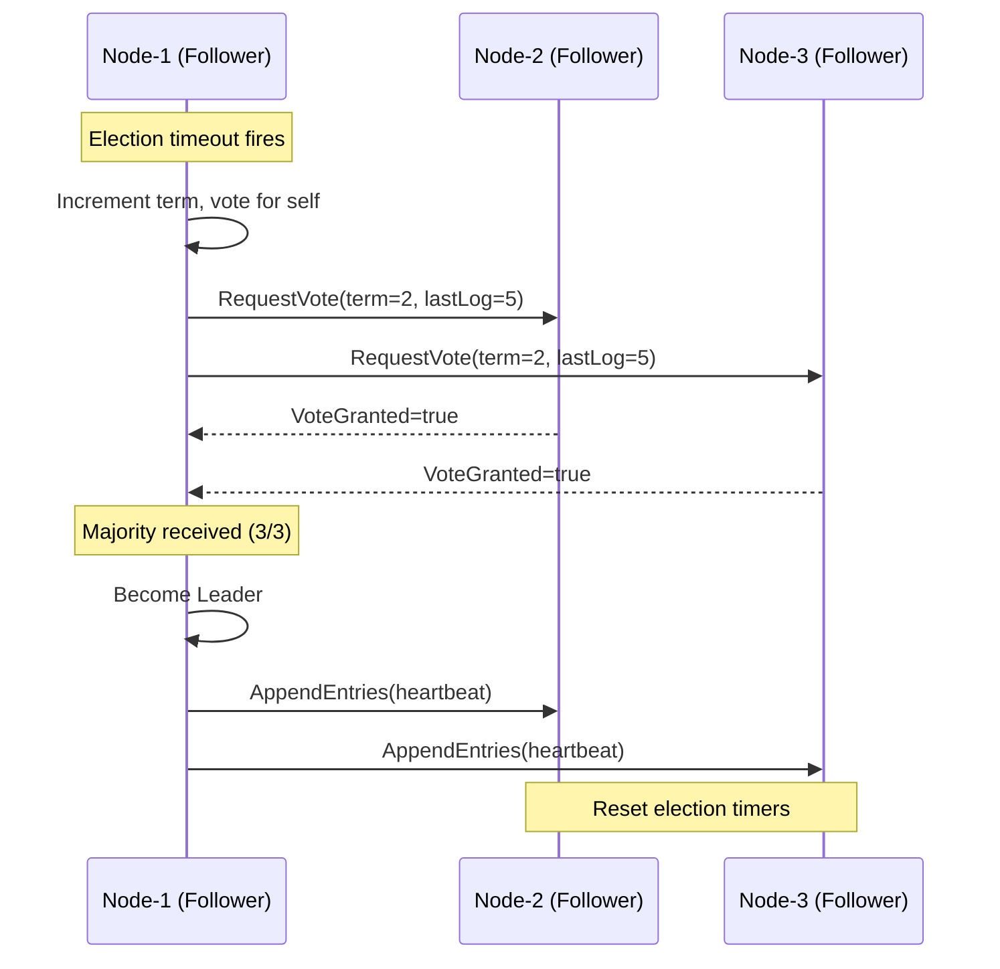
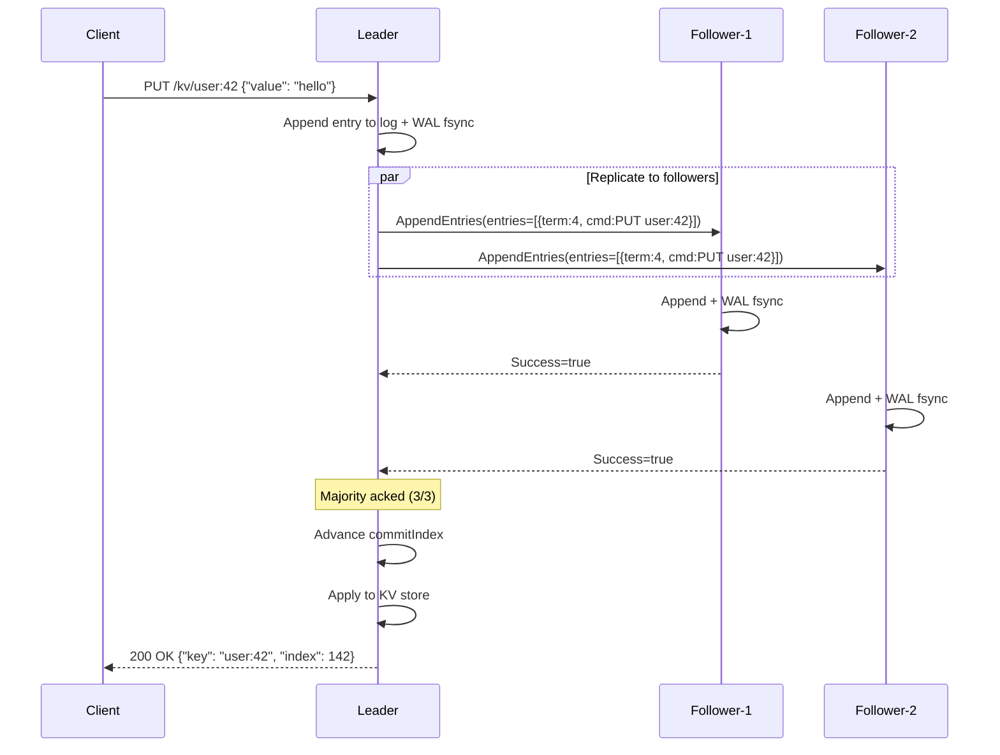

# Architecture

RaftKV is a distributed key-value store that implements the Raft consensus algorithm from scratch. This document covers the system architecture, protocol flows, WAL format, and design tradeoffs.

## Component Breakdown

| Component | File(s) | Responsibility |
|-----------|---------|---------------|
| **Raft Core** | `internal/raft/node.go` | Leader election, state transitions, RPC handlers |
| **Log Replication** | `internal/raft/replication.go` | Per-peer replication, commit pipeline, client commands |
| **Raft Log** | `internal/raft/log.go` | 1-indexed in-memory log with truncation and search |
| **WAL** | `internal/storage/wal.go` | Append-only persistence with CRC32 and fsync |
| **gRPC Transport** | `internal/transport/grpc.go`, `server.go` | Network layer — lazy connect, connection pooling |
| **HTTP API** | `internal/api/handler.go` | REST endpoints, leader redirect, health probes |
| **KV Store** | `internal/kvstore/store.go` | State machine — `map[string]string` with Apply() |
| **Config** | `internal/config/config.go` | Flag and env-var parsing |
| **Chaos Tests** | `tests/chaos/` | In-process cluster with partition/delay injection |

## Leader Election



**Election timeout:** Random between 150ms–300ms, reset on every valid AppendEntries.

**Vote granting rules:**
1. Candidate's term must be ≥ our currentTerm
2. We haven't voted in this term, or already voted for this candidate
3. Candidate's log is at least as up-to-date (higher last term wins; if equal, longer log wins)

## Log Replication Flow



**Fast log rollback:** When AppendEntries fails due to log inconsistency, the follower returns `ConflictTerm` and `ConflictIndex`. The leader binary-searches its log for the conflict term to skip entire terms, rather than decrementing `nextIndex` one entry at a time.

## WAL Format Specification

Each WAL file is named `wal_NNNNNN.log` (monotonic IDs). Records are binary-encoded:

```
┌──────────────┬──────────────┬─────────────────┬────────────┐
│ Record Type  │ Payload Len  │  Payload (JSON)  │   CRC32    │
│  (4 bytes)   │  (4 bytes)   │   (N bytes)      │  (4 bytes) │
└──────────────┴──────────────┴─────────────────┴────────────┘
     LE uint32      LE uint32     JSON bytes       LE uint32
```

**Record types:**

| Type | Value | Payload Example |
|------|-------|----------------|
| `RecordTerm` | 1 | `{"term": 42}` |
| `RecordVote` | 2 | `{"voted_for": "node-2", "term": 42}` |
| `RecordEntry` | 3 | `{"index": 10, "term": 42, "command": "eyJvcCI6InB1dCIsImtleSI6ImZvbyJ9"}` |

**CRC32:** IEEE polynomial, computed over `[type + length + payload]` bytes. On replay, if CRC doesn't match, the WAL is truncated at the last valid record.

**Rotation:** When a WAL file exceeds 64MB, a new file is created with the next monotonic ID. Replay reads all WAL files in order.

**Fsync:** Every `Append()` call syncs to disk before returning. This is the durability guarantee — no acknowledged write is ever lost.

## Correctness Invariants

These are enforced in code with inline comments at the enforcement site:

1. **`currentTerm` only increases, never decreases**
   - Enforced in: `becomeFollowerLocked()`, `startElection()`

2. **`votedFor` is persisted to WAL before any VoteReply is sent**
   - Enforced in: `HandleRequestVote()`

3. **A log entry is never deleted once `commitIndex` advances past it**
   - Enforced in: `TruncateAfter()` — only truncates conflicting entries (which cannot be committed)

4. **Leader only commits entries from its own term**
   - Enforced in: `advanceCommitIndexLocked()`
   - Reference: Raft paper Figure 8

## Tradeoffs

| Decision | Why | Cost |
|---|---|---|
| Single mutex per node | Eliminates deadlocks from bidirectional RPC callbacks | No parallel RPC handling |
| fsync per WAL write | No acknowledged write ever lost | ~1ms write latency floor |
| No log compaction | Simpler correctness — replay grows linearly | Restart time grows with log |
| gRPC for transport | Typed, retry-friendly, Go-native | ~2ms overhead vs raw TCP |
| Leader-only reads | Linearizable by construction | All reads pay redirect cost |
| JSON WAL payloads | Human-readable, easy debugging | Larger records vs binary encoding |
| In-memory KV store | Simplicity — no embedded DB dependency | Data limited by RAM |
