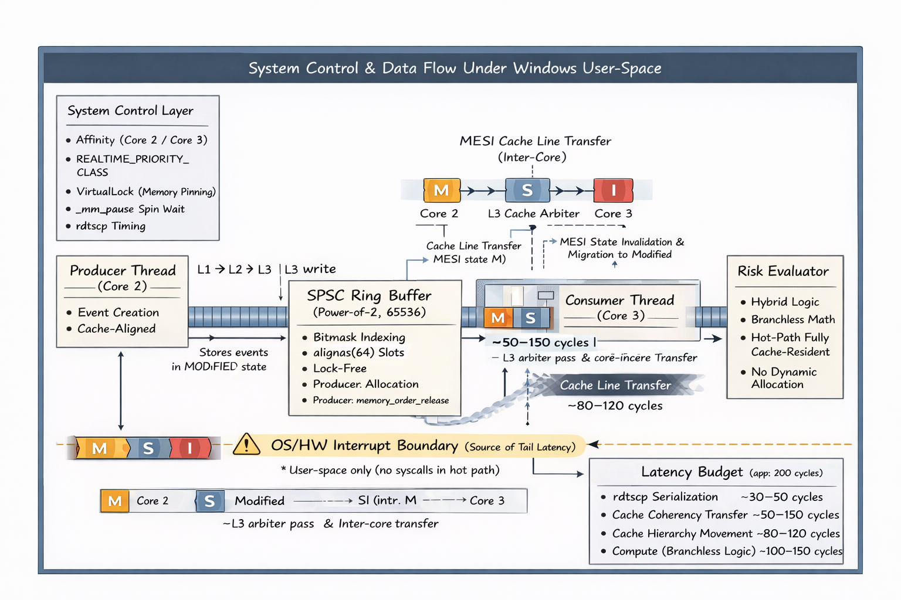

# GammaFlow: Ultra-Low Latency C++20 Execution Engine

**Abstract:** GammaFlow is a deterministic, high-throughput C++20 pipeline designed to evaluate streaming data in sub-200 nanoseconds, exploring the boundaries of user-space performance on x86 architectures by eliminating abstraction overhead and engineering for strict cache locality.

---

## Latency Characteristics & Environmental Variance

* **Compute Latency (p50 range: ~90ns to ~142ns)**: The absolute baseline 90ns median execution limit occurred exclusively when the CPU branch predictor was allowed to run completely un-fenced. The **~142ns median** represents the fully deterministic, conservatively safe instruction-fenced (`__rdtscp`) baseline, strictly cache-aligned without `#pragma pack` misaligned load penalties.

* **System Jitter (p99.9 tail variance: ~2.35µs to ~18µs)**: This represents the Windows Operating System boundary. The lower-bound runs (~2.35µs) represent virtually undisturbed CPU execution epochs. The ~18µs spikes represent inescapable, unmaskable OS-level hardware interrupts (such as SMIs and DPC routines) alongside hypervisor clock ticks that natively cannot be bypassed inside Windows user-space.

---

## System Architecture & Optimizations

### The Data Path
* **Lock-Free SPSC Ring Buffer**: Engineered a strictly Single-Producer Single-Consumer queue array relying entirely on C++11 sequence coherency (`std::memory_order_acquire` / `std::memory_order_release`).
* **Zero-Cost Wrapping**: Explicitly replaced intensive modulo arithmetic (`%`) with wait-free bitwise AND masking (`idx & mask`).

### Cache Locality
* **Struct Alignment**: Explicitly eradicated `#pragma pack` directives in favor of exact `alignas(64)` padding on the event payloads. 
* **False Sharing Annihilation**: By manually padding the payload array boundaries to exactly equal the size of one x86 L1 physical cache line, we entirely neutralize MESI protocol cache-invalidation stalls ("false sharing") between the Producer sequence and the Consumer evaluation core.

### Hybrid Compute Pipeline
* **Hybrid Branching**: The `RiskEvaluator` evolved into a selectively dual-state computational model. It uses standard `if/else` early-returns for highly predictable structural validation (like zero-price verification) to massively leverage the native CPU branch predictor. 
* **Parallel Boolean Mathematics**: Conversely, completely unpredictable, un-patterned data-dependent risk calculations are mapped directly into parallel boolean multiplications `(price < threshold) * penalty` to aggressively prevent pipeline flushes.

### OS Isolation
* **Process Sub-System Elevation**: The engine invokes `REALTIME_PRIORITY_CLASS` to elevate above all standard user processes.
* **Core Affinity & Pinning**: Threads are explicitly bound to Cores 2 and 3 to actively hide from the Windows default Core 0 OS interrupt router. 
* **Time Critical Targeting**: Dynamic priority boosting is forcefully disabled (`SetThreadPriorityBoost(..., TRUE)`) and threads are elevated to `THREAD_PRIORITY_TIME_CRITICAL`.
* **Hardware Spin-Waits**: Replaced OS-level context switching with tight polling loops utilizing the Intel `_mm_pause()` intrinsic.
* **Memory Paging**: Utilized `VirtualLock()` to pin the internal structures directly into physical RAM, neutralizing hard-disk page vaults.

---

## Limitations & Future Scope

While GammaFlow physically exhausts the absolute bare-metal architectural performance limits on Windows NT, the operating system natively prohibits sub-microsecond determinism in the 99.9th+ percentile. 

To achieve true deterministic sub-microsecond tail latency entirely devoid of OS jitter, the core architecture must migrate off the Windows ecosystem. Future iterations of this pipeline would be deployed to a customized Linux kernel compiled with `PREEMPT_RT`, explicitly utilizing `isolcpus`, `nohz_full`, and `rcu_nocbs` to fully sever the user-space ring execution cores from the kernel clock framework.
